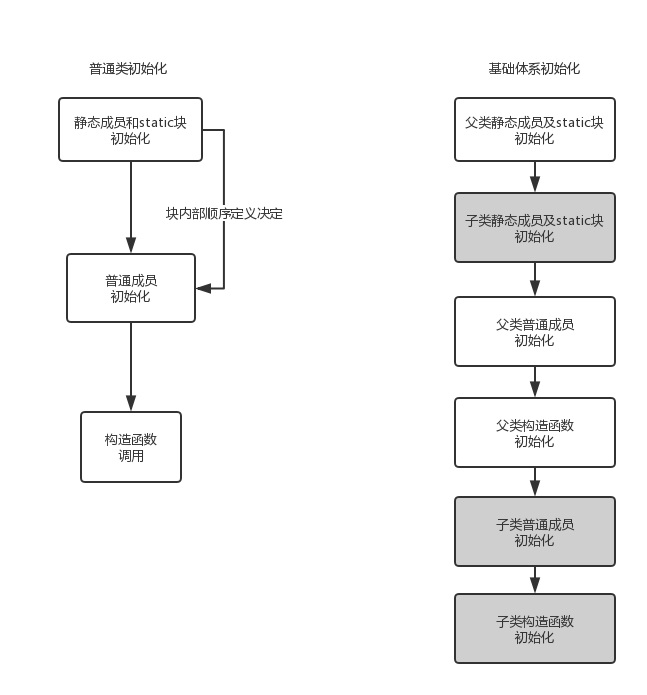

# Java 类加载顺序

<!--  -->
![java-init][java-init]

有的朋友问到内部的机制，上述的初始化顺序是由下面的几条规则决定的：

  1. 首先初始化静态域是因为静态域是放在方法区和 `class` 对象在一起的。
  2. 由于类加载的时候，会向上查找基类，因为子类的初始化依赖于基类首先初始化。所以会首先发生“基类->子类"顺序的类加载，类加载过程中，顺便完成了静态域的初始化。
  3. 另外一条规则是初始化块和域的初始化按照声明的顺序进行。详见《Thinking in Java》中译本第四版的 P147 页

[java-init]: http://ww1.sinaimg.cn/large/ac1cf9b4gy1g0drp8ipmmj20hz0jbdgw.jpg