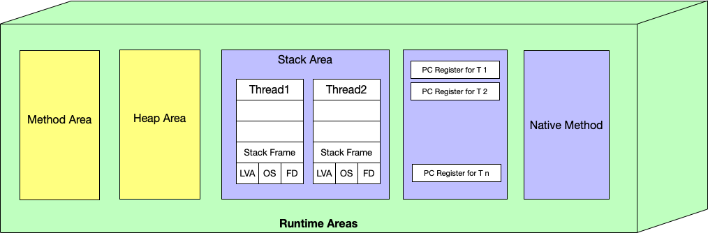

# Java 内存模型

    - LVA： Local Variable Array
    - OS：Operand Stack
    - FD： Frame Data

## 概念解释：

### - Program Counter Registers：

程序计数器可以理解 `Java` 字节码程序行号指示器。根据指示选取下一条代码的代码的执行，分支、跳转、循环、异常处理，线程恢复都依赖于此。此内存区域线程私有。

### - Java VM Stack

`Java` 虚拟机栈的生命周期与线程相同，同样也是线程私有的。它描述的是：每个方法的执行同时会创建一个 `Stack Frame`，用于存储局部变量、操作数栈、动态链接、方法出口等信息。

### - Native Method Stack

本地方法栈与 VM 栈所发挥的作用基本一致，区别是虚拟机为 `Java` 方法（也就是字节码）服务，而本地方法 `Stack` 则为虚拟机所使用的 `Native` 方法服务。

### - Java VM Heap

对于大多数的应用来说，`Java` 堆是 `JVM` 内存中最大的一块。且线程共享，虚拟机启动时创建。此区域唯一目的：存放对象实例，几乎所有的对象实例都在这里分配内存。同时也是 GC (Garbage Collector) 主要的活动区域。

### - Method Area

方法区和 `Java` 堆一样，是各个线程共享的区域，主要作用是：存储已被虚拟机加载的类信息、常量、静态变量、即时编译器编译后的代码等数据。

### - Runtime Constant Pool

常量池是方法区的一部分，`class` 文件除了有类的版本，字段，方法，接口等描述信息，还有一项就是常量池。